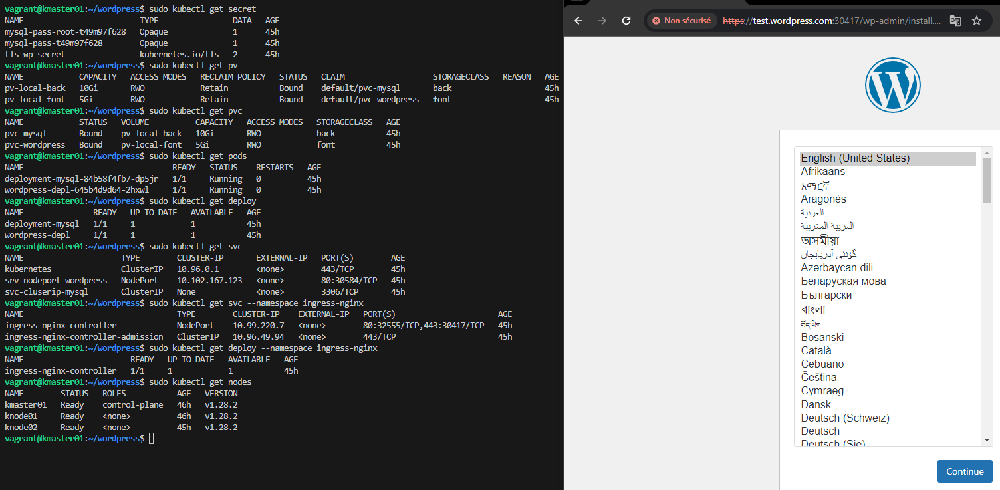

# Déploiement de l'environnement de production pour WordPress en On-Premise avec Kubernetes et Vagrant

Ce dépôt permet de déployer un environnement de production pour WordPress en On-Premise avec Kubernetes et Vagrant.

## Prérequis

- Installez VirtualBox, Vagrant et Git sur votre machine.

## Contenu du dépôt

- `Vagrantfile`: Un fichier de configuration Vagrant pour spécifier les paramètres des machines virtuelles et déployer un nœud Master et deux  nœuds worker Kubernetes.
- `install-master.sh`: Un script shell pour installer et configurer un nœud Master Kubernetes.
- `install-worker.sh`: Un script shell pour installer et configurer un nœud worker Kubernetes.
- `setup-hosts.sh`: Un script shell pour configurer les fichiers hosts sur les nœuds pour la résolution des noms.
-  `wordpress` : Un dossier contient des fichiers yaml pour configurer les PersistentVolumes, les PersistentVolumeClaims, les secrets, ingress-nginx, MySQL et Wordpress.  

## Instructions d'utilisation

1. Clonez ce dépôt sur votre machine locale :

   ```bash
   git clone https://github.com/MassiTZ/Projet02-Kubernetes.git
   
2. Changez de répertoire vers le dépôt cloné :

   ```bash
   cd Projet02-Kubernetes

3. Démarrez les machines virtuelles Vagrant en exécutant la commande suivante :
   
    ```bash
    vagrant up
  - Cela lancera trois machines virtuelles Ubuntu, un nœud Master et deux nœuds Worker Kubernetes.

4. Configurez le fichier hosts de votre machine et personnalisez vos secrets.
5. Accédez au nœud Master pour gérer le déploiement de Wordpress :

    ```bash
    Vagrant ssh kmaster01
    cd wordpress
    # Géner les certificats
    openssl req -x509 -nodes -days 365 -newkey rsa:2048 -keyout tls.key -out tls.crt -subj "/C=FR/ST=ILE-DE-FRANCE/L=PARIS/O=IT/OU=MASSI/CN=test.wordpress.com"
    sudo kubectl create secret tls tls-wp-secret --key tls.key --cert tls.crt
    # Déployer mysql et wordperss
    sudo kubectl apply -k .
    # Déployer controller Ingress NGINX et la configuration ingress
    sudo kubectl apply -f deploy.yaml
    sudo kubectl apply -f ingress-wp.yaml
    
 ##  Accès à WordPress

   - Une fois que les services sont lancés, vous pouvez accéder à votre site WordPress en ouvrant un navigateur web et en visitant l'adresse https://test.wordpress.com:[Num-de-port].

   

     
 
